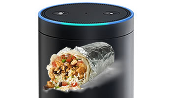

# chipotlexa

An Alexa skill for the [Amazon Echo](http://amazon.com/echo) or other Alexa-enabled devices for placing a Chipotle online order.

## Usage

You: _"Alexa, use Chipotle to place an order."_

Alexa: _"Ok, It looks like last time you ordered a chicken burrito bowl... Would you like to order this again?"_

You: _"Yes."_

Alexa: _"Your order will be ready at 7:30 PM. To place this order, please say confirm."_

You: _"Confirm."_

Alexa: _"Your order will be ready at 7:30 PM at the location on 5699 S. Broadway. Enjoy your meal!"_

## Installation

This isn't an official Alexa skill that can be installed via the Alexa app. This is mainly due to the way authentication works with the Chipotle API, and Amazon has certain requirements for how skills should authenticate with 3rd party APIs. So, to use this skill you need to:
  1. [Create the Lambda function on AWS](https://developer.amazon.com/appsandservices/solutions/alexa/alexa-skills-kit/docs/developing-an-alexa-skill-as-a-lambda-function)
  2. [Register an Alexa device for testing](https://developer.amazon.com/public/solutions/alexa/alexa-skills-kit/docs/testing-an-alexa-skill#h2_register)
  3. [Register the custom skill in the developer portal](https://developer.amazon.com/public/solutions/alexa/alexa-skills-kit/docs/registering-and-managing-alexa-skills-in-the-developer-portal) (specifying the ARN of the Lambda function you created as the _Endpoint_).

## Configuration / Deploy

This skill requires you to create a configuration file specifying your Chipotle credentials and preferred location. This needs to be entered into a `profile.json` file which will get packaged up with the rest of the Lambda code in this project. An example file is [here](sample-profile.json). Once the file is created, you can build a package for deploying to Lambda:

  1. Run `npm run zip` to create a `build.zip` file for uploading.

  2. Upload the `build.zip` file to the Lambda console.

###### Disclaimer

_All product and company names are trademarks™ or registered® trademarks of their respective holders. Use of them does not imply any affiliation with or endorsement by them._
